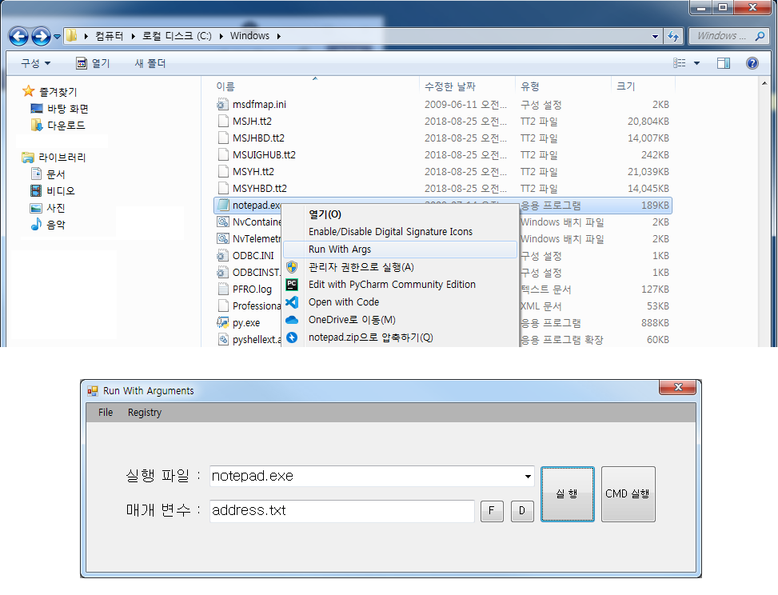

# RunWithArguments
일부 프로그램의 경우, 실행할때 매개변수를 입력해야되는 경우가 있습니다.

본 프로그램을 사용하면 매개 변수를 쉽게 입력해서 실행 시킬 수 있습니다.

# 사용 방법
1.Registry 메뉴에서 "Set Menu"를 선택하여 컨택스트 메뉴에 등록되도록 해줍니다.

  Remove Menu를 선택하면 컨텍스트 메뉴에서 삭제됩니다.

2.EXE 파일에서 마우스 오른쪽 버튼을 클릭하여 "Run With Args"를 선택하면 매개변수 입력 창이 뜹니다.

  필요한 명령을 입력한 뒤에 "실행"을 클릭하면 입력한 매개 변수와 함께 실행됩니다.

3.바탕화면이나 폴더에서 마우스 오른쪽 버튼을 클릭하여 "Run With Args"를 선택하면, 

  해당 위치에 있는 모든 파일을 "실행 파일"에 등록해서 사용자가 원하는 파일을 선택할 수 있도록 하였습니다.

4.매개변수에 파일이나 폴더를 입력해야하는 경우가 있는데, F버튼은 파일을, D버튼을 폴더를 선택하는 창을 띄워줘서 필요한 파일이나 폴더를 쉽게 입력할 수 있도록 하였습니다.

5."CMD 실행"은 해당 명령을 CMD창에서 실행합니다. 

